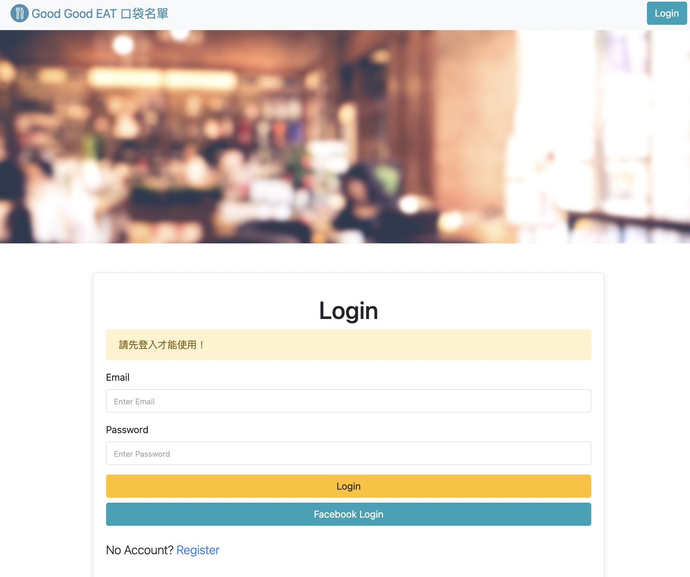

# A1: 餐廳清單．Final  
使用者 `註冊帳號` 後，可以打造 「 個人專屬 」的美食清單！




## 功能列表  (2022.11.04更新)
- 使用者 `登入` 驗證：
  - 請先 Email 註冊，再登入
  - 或者，直接由 Facebook 註冊並登入

- 使用者可以 `新增` 一家餐廳

- 使用者可以 `瀏覽` 全部餐廳簡介
  - 餐廳照片
  - 餐廳名稱
  - 餐廳分類
  - 餐廳評分
  
- 使用者可以 `瀏覽` 一家餐廳的詳細資訊
  - 類別
  - 地址
  - 電話
  - 描述
  - 圖片
  
- 使用者可以 `修改` 一家餐廳的資訊

- 使用者可以 `刪除` 一家餐廳

- 使用者可以 `搜尋` 「餐廳名稱/類別」關鍵字，來找到特定的餐廳


## 開始使用
1. 確認有安裝 node.js 與 npm
2. 將專案 clone 到本地，在終端機輸入：

   ```
   git clone https://github.com/cosine0720/W3_A1_Restaurant-List.git
   ```
   
3. 進入專案資料夾，在終端機輸入：

   ```
   cd W3_A1_Restaurant-List
   ```

4. 在本地開啟之後，透過終端機輸入：

   ```
   npm install
   ```
   
5. 安裝完畢後，繼續輸入：

   ```
   npm run start
   ```

6. 若看見此行訊息則代表順利運行，打開瀏覽器進入到以下網址

   ```
   This app is opening on http://localhost:3000 .
   mongodb connected!
   ```

7. 若欲暫停使用

   ```
   ctrl + c
   ```


## 開發者

Ｃosine Huang
